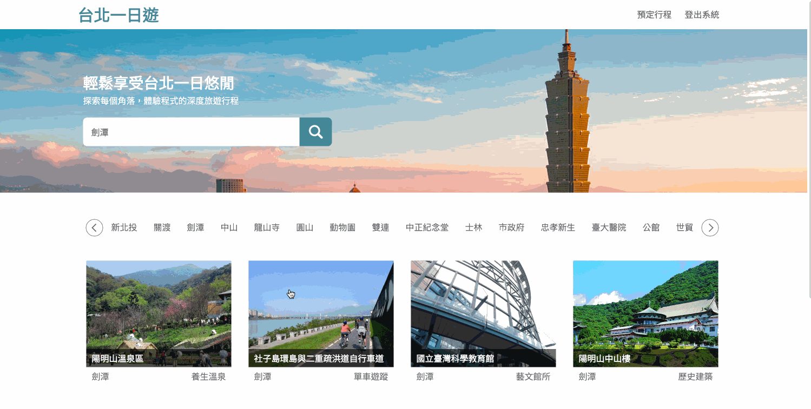
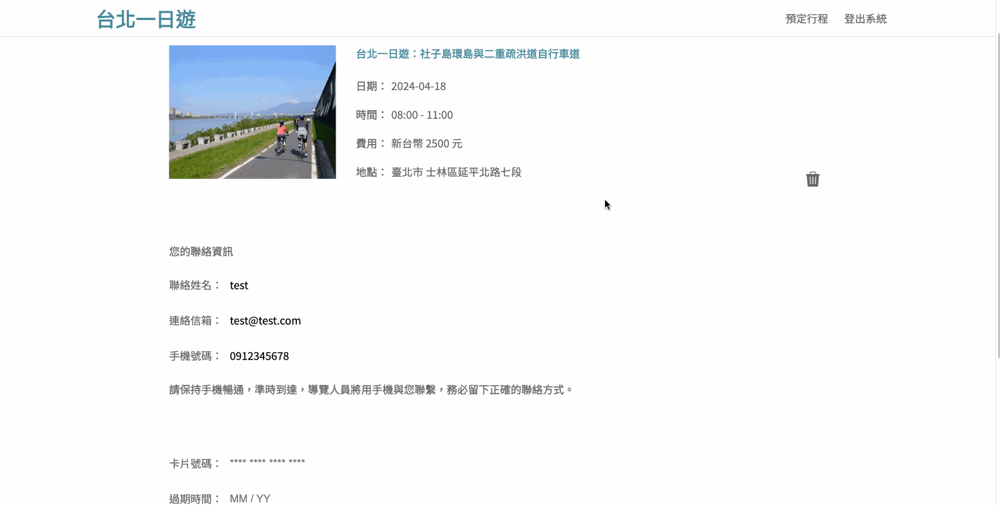

# [台北一日遊 Taipei Day Trip](http://44.219.151.161:3000/)

A Taipei travel attraction website features searching, booking, and payment with TayPay

- Testing Account

  | Email           | Password |
  | --------------- | -------- |
  | `test@test.com` | `test`   |

- Testing Card Info

  | Card Number           | Expiration Date | CVV   |
  | --------------------- | --------------- | ----- |
  | `4242-4242-4242-4242` | `12/34`         | `123` |

# Tech Stack

- Front-end
  - HTML, CSS (SCSS)
  - JavaScript
    - Import and export: utilizes for organizing modules
- Back-end
  - Python Flask
    - Blueprint: helps in organizing codes
    - JWT token: helps in usememorizing log-in status
  - MySQL
  - AWS
    - EC2, Elastic IP

# Main Features

- Filter data and book a trip
  
- Infinite scroll for attractions
  
- Integrate payment with TayPay
  

# Database Schema

</img>

# Contact

- Name: Xiao-Jing Chen 陳筱靜
- Email: vera.xj.chen@gmail.com
- LinkedIn: [in/vera-xj-chen](https://www.linkedin.com/in/vera-xj-chen/)
