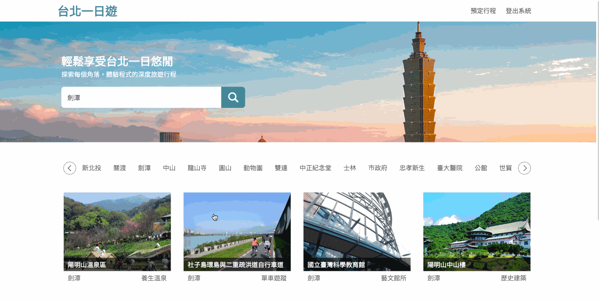
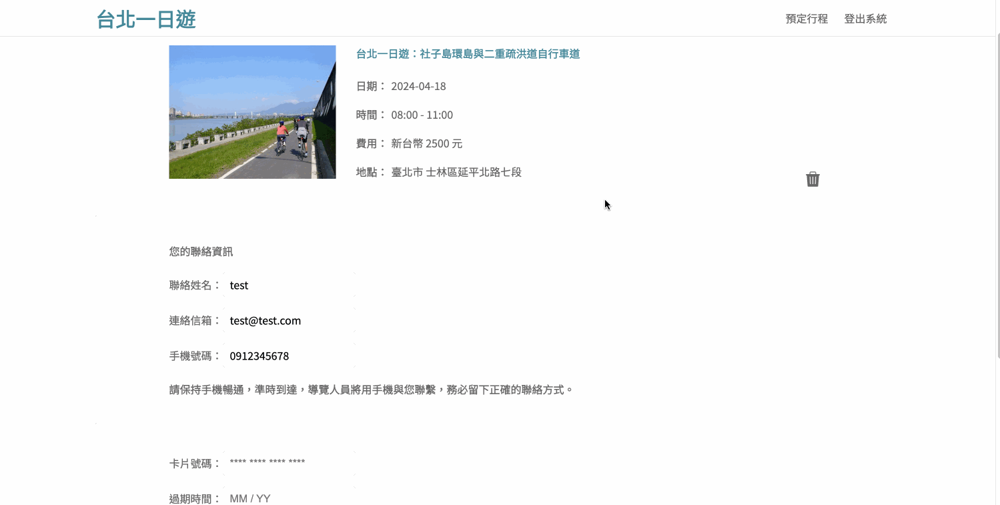

# [台北一日遊 Taipei Day Trip](http://44.219.151.161:3000/)

A Taipei travel attraction website features searching, booking, and payment with TayPay

- Testing Account

  | Email           | Password |
  | --------------- | -------- |
  | `test@test.com` | `test`   |

- Testing Card Info

  | Card Number           | Expiration Date | CVV   |
  | --------------------- | --------------- | ----- |
  | `4242-4242-4242-4242` | `12/34`         | `123` |

## Tech Stack

### Front-end

- HTML
- SCSS
- JavaScript (ES Modules)

### Back-end

- Python
  - Flask
  - Blueprint
  - JWT Authentication
- MySQL

### Deployment

- AWS EC2
- Elastic IP

## Main Features

- Synchronize attraction data from the latest Taipei Open API.
- Filter data and book a trip
  
- Infinite scroll for attractions
  
- Integrate payment with TayPay
  

## Data Synchronization

Attraction data is synchronized with the latest Taipei Open API.

For synchronization details, mapping rules, and update workflow, see:

- [`docs/attraction-data-sync.md`](./docs/attraction-data-sync.md)
- [`docs/attraction-mapping-rules.md`](./docs/attraction-mapping-rules.md.md)

## Project Structure

```text
app/
├── routes/         # Flask API routes
├── static/         # Images, JavaScript, and SCSS
├── templates/      # HTML templates
├── app.py          # Application entry point
└── db.py           # MySQL connection pool

data/               # Seed data and synchronization resources

database/
├── migrations/     # One-time database migrations
├── tables/         # Database schema
├── update_attractions.sql
├── insert_attractions.sql
└── taipei_trip.sql # Database export

docs/               # Synchronization documentation
scripts/            # Attraction synchronization scripts

deploy.sh
dev.sh
requirements.txt
```

## EC2 Environment Setup

Configure the EC2 timezone:

```bash
sudo timedatectl set-timezone Asia/Taipei
```

Verify the timezone settings:

```bash
timedatectl
```

Restart MySQL to apply the updated system timezone:

```bash
sudo systemctl restart mysql
```

```sql
SELECT NOW();
SELECT @@system_time_zone;
SELECT @@global.time_zone;
SELECT @@session.time_zone;
```

Expected:

```text
@@system_time_zone = CST
@@global.time_zone = SYSTEM
@@session.time_zone = SYSTEM
```

## Database Schema

</img>

## Data Source & Attribution

- Attraction data is provided by the Taipei Open API.
- Attraction images are sourced from the Taipei Open API and placeholder image from Unsplash.

# Contact

- Name: Xiao-Jing Chen 陳筱靜
- Email: vera.xj.chen@gmail.com
- LinkedIn: [in/vera-xj-chen](https://www.linkedin.com/in/vera-xj-chen/)
